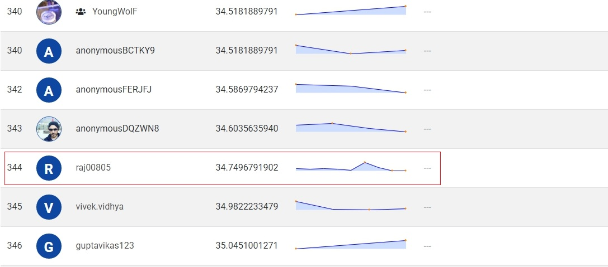

URL - https://datahack.analyticsvidhya.com/contest/ltfs-data-science-finhack-2-an-online-hackathon/

# LTFS Data Science FinHack 2

LTFS receives a lot of requests for its various finance offerings that include housing loan, two-wheeler loan, real estate financing and micro loans. The number of applications received is something that varies a lot with season. Going through these applications is a manual process and is tedious. Accurately forecasting the number of cases received can help with resource and manpower management resulting into quick response on applications and more efficient processing.

## Problem Statement
You have been appointed with the task of forecasting daily cases for next 3 months for 2 different business segments aggregated at the country level keeping in consideration the following major Indian festivals (inclusive but not exhaustive list): Diwali, Dussehra, Ganesh Chaturthi, Navratri, Holi etc. (You are free to use any publicly available open source external datasets). Some other examples could be:

Weather Macroeconomic variables Note that the external dataset must belong to a reliable source.

Data Dictionary The train data has been provided in the following way:

* For business segment 1, historical data has been made available at branch ID level For business segment 2, historical data has been made available at State level.

Train File Variable Definition application_date Date of application segment Business Segment (1/2) branch_id Anonymised id for branch at which application was received state State in which application was received (Karnataka, MP etc.) zone Zone of state in which application was received (Central, East etc.) case_count (Target) Number of cases/applications received

Test File Forecasting needs to be done at country level for the dates provided in test set for each segment.

Variable Definition id Unique id for each sample in test set application_date Date of application segment Business Segment (1/2)

### Evaluation
Evaluation Metric The evaluation metric for scoring the forecasts is **MAPE (Mean Absolute Percentage Error)* M with the formula:

Where At is the actual value and Ft is the forecast value.

The Final score is calculated using MAPE for both the segments using the formula:

### Important Notes

Note that feasibility of implementation of top solutions will be considered while adjudging winners The solution must produce satisfactory results for both the business segments

Public and Private Split Test data is further divided into Public (1st Month) and Private (Next 2 months)

# Leaderboard
## Team:  raj00805

* **[Public LB](https://datahack.analyticsvidhya.com/contest/ltfs-data-science-finhack-2-an-online-hackathon)** : **344th/883 Rank**
* **[Private LB](https://datahack.analyticsvidhya.com/contest/ltfs-data-science-finhack-2-an-online-hackathon)** : **338th/883 Rank**

## Things to learn
* Prophet for Time series (Visualisations)
* Time series forecasting Features
* Simple models that perform well and which meet the feasiblity criteria for deployments.

