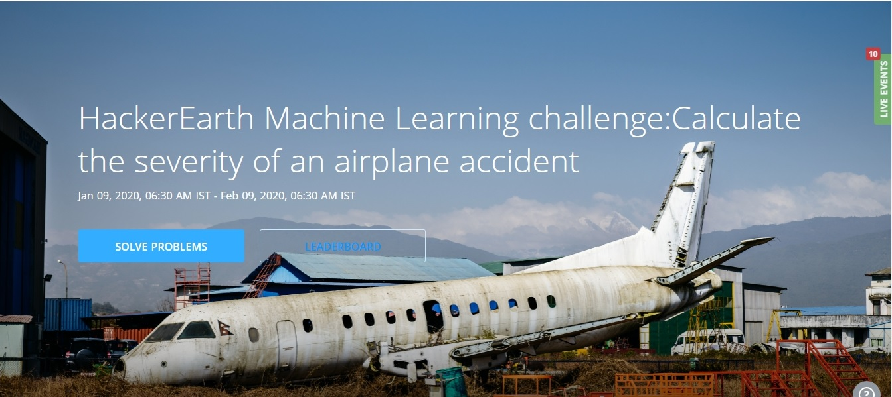

URL - https://www.hackerearth.com/challenges/competitive/airplane-accident-severity-hackerearth-machine-learning-challenge/

# HackerEarth Machine Learning challenge:Calculate the severity of an airplane accident

## Problem Statement

Flying has been the go-to mode of travel for years now; it is time-saving, affordable, and extremely convenient. According to the FAA, 2,781,971 passengers fly every day in the US, as in June 2019. Passengers reckon that flying is very safe, considering strict inspections are conducted and security measures are taken to avoid and/or mitigate any mishappenings. However, there remain a few chances of unfortunate incidents.

Imagine you have been hired by a leading airline. You are required to build Machine Learning models to anticipate and classify the severity of any airplane accident based on past incidents. With this, all airlines, even the entire aviation industry, can predict the severity of airplane accidents caused due to various factors and, correspondingly, have a plan of action to minimize the risk associated with them.

### Data set

The dataset consists of certain parameters recorded during the incident⁠ such as cabin temperature, turbulence experienced, number of safety complaints prior to the accident, number of days since the last inspection was conducted before the incident, an estimation of the pilot’s control given the various factors at play, and the likes. 

The benefits of practicing this problem by using Machine Learning techniques are as follows:

This challenge will encourage you to apply your Machine Learning skills to build models that can anticipate the severity of any airplane accident
This challenge will help you enhance your knowledge of classification actively. Classification is one of the basic building blocks of Machine Learning
We challenge you to build a model that predicts how severe an airplane accident could be.

### Prizes

1st Prize - 250 USD
2nd Prize - 150 USD
3rd Prize - 75 USD

### Overview

Machine learning is an application of artificial intelligence (AI) that provides systems with the ability to automatically learn and improve from experience without being explicitly programmed. Machine Learning is a science that determines patterns in data. These patterns provide deeper meaning to problems and help you to first understand problems better and then solve the same with elegance.

Here is the new HackerEarth Machine Learning Challenge:Calculate the severity of an airplane accident.

This challenge is designed to help you improve your Machine Learning skills by competing and learning from fellow participants.

### Why should you participate?

To analyze and implement multiple algorithms and determine which is more appropriate for a problem

To get hands-on experience in Machine Learning problems

### Who should participate?

Working professionals

Data science or Machine Learning enthusiasts

College students (if you understand the basics of predictive modeling)

Tutorials

Machine Learning practice

### Note:

In order to be able to claim your prizes, your HackerEarth profile must be completed more than 50%.
The prizes will be disbursed in the second week of the following month.

## GUIDELINES

Your output will be evaluated only for 50% of the test data while the contest is running. Once the contest is over, output for the remaining 50% of the data will be evaluated and the final rank will be awarded.

You will have to upload your output on the problem page in the format given in the problem statement. In addition to your output, you will also have to submit your source and other files in .zip or .tar compressed archive.

The total number of submissions allowed by a participant is 3000. The maximum number of submissions a participant can make in a day is 10.

You can use any tools or libraries for building your solution. There is no restriction on the tools that you can use.

You can only participate as an individual.

The IP of the product/code of the winners will belong to HackerEarth if they choose to accept the prize. Other participants will retain complete IP over their code/product and they may wish to put it in open source domain under any license they want to.

By participating in this Machine Learning, you agree to the terms and conditions of HackerEarth.

# Leaderboard
## Team:  Rajesh Goel
!(Rank.jpg)

* **[Public LB](https://www.hackerearth.com/challenges/competitive/airplane-accident-severity-hackerearth-machine-learning-challenge/leaderboard/how-severe-can-an-airplane-accident-be-03e7a3f1/page/5/)** : **207th/7449 Rank**

